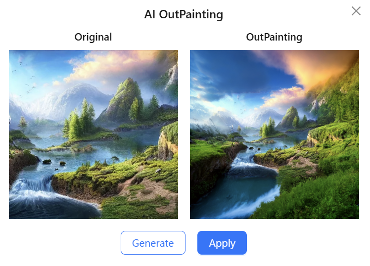

# IntelliPicHub

<div align="center">

🌐 **English** | [中文](README_zh.md) | [日本語](README_ja.md)

</div>

## Introduction

IntelliPicHub is a multi-functional image display platform

- **Public Space**: Can be used as a material website or wallpaper website
- **Private Space**: Can serve as a personal album or personal portfolio
- **Team Space**: Can invite members to share images and materials

**[Try Online](https://picture.jiaheliu.top/)**

## Features

### AI Image Extension
Additionally, you can perform AI image extension on pictures


### Reverse Image Search
Reverse image search (search for similar images)



### Multi-user Real-time Collaborative Editing
In team spaces, you can perform multi-user real-time collaborative editing on images


## Deployment Guide

### Environment Requirements

The following environments should be installed on the system:
- MySQL
- Redis
- Java 17
- Maven

### 1. Clone the Project

```bash
git clone https://github.com/Jiaheliu137/IntelliPicHub
cd IntelliPicHub
```

### 2. Configure Backend

#### 2.1 Copy Configuration File

```bash
cd IntelliPicHub-backend/src/main/resources
cp application.example.yml application-local.yml
```

#### 2.2 Fill in Configuration Information

Fill in the configuration in `application-local.yml` according to the prompts

#### 2.3 Configure Tencent Cloud Storage

Obtain the following configuration information from [Tencent Cloud Storage Bucket](https://console.cloud.tencent.com/cos/bucket):

```yaml
cos:
  client:
    host: your_cos_host
    secretID: your_cos_secret_id
    secretKey: your_cos_secret_key
    region: your_cos_region
    bucket: your_cos_bucket_name
```

And enable [Data万象 Service](https://console.cloud.tencent.com/ci)

### 3. Configure Frontend

```bash
cd IntelliPicHub-frontend/src/config
```

Change `const PROD_DOMAIN = ''` in the `index.ts` file to your own domain

### 4. Start Backend

```bash
cd IntelliPicHub-backend
mvn clean package -DskipTests
java -jar target/IntelliPicHub-backend-0.0.1-SNAPSHOT.jar --spring.profiles.active=local
```

### 5. Build Frontend

```bash
cd IntelliPicHub-frontend
npm run build-only
```

### 6. Nginx Configuration

Nginx configuration reference, replace the domain and frontend build path with your own:

```nginx
# IntelliPicHub
server {
    listen 80;
    listen 443 ssl http2;
    server_name picture.jiaheliu.top;

    ssl_certificate     /etc/nginx/save_cert_key/wildcard/cert.pem;
    ssl_certificate_key /etc/nginx/save_cert_key/wildcard/key.pem;

    if ($scheme = http) {
        return 301 https://$host$request_uri;
    }

    location / {
        root /root/github_project/IntelliPicHub/IntelliPicHub-frontend/dist;
        index index.html;
        try_files $uri $uri/index.html /index.html;
    }

    location /api {
        proxy_pass http://localhost:8123/api;
        proxy_set_header Host $proxy_host;
        proxy_set_header X-Real-IP $remote_addr;
        proxy_set_header X-Forwarded-For $proxy_add_x_forwarded_for;
        proxy_set_header Connection "";
        proxy_buffering off;
    }
    
    location /api/ws {
        proxy_pass http://localhost:8123/api/ws;
        proxy_http_version 1.1;
        proxy_set_header Upgrade $http_upgrade;
        proxy_set_header Connection "upgrade";
        proxy_set_header Host $proxy_host;
        proxy_set_header X-Real-IP $remote_addr;
        proxy_set_header X-Forwarded-For $proxy_add_x_forwarded_for;
        proxy_read_timeout 86400s;
        proxy_send_timeout 86400s;
        proxy_buffering off;
    }
}
``` 