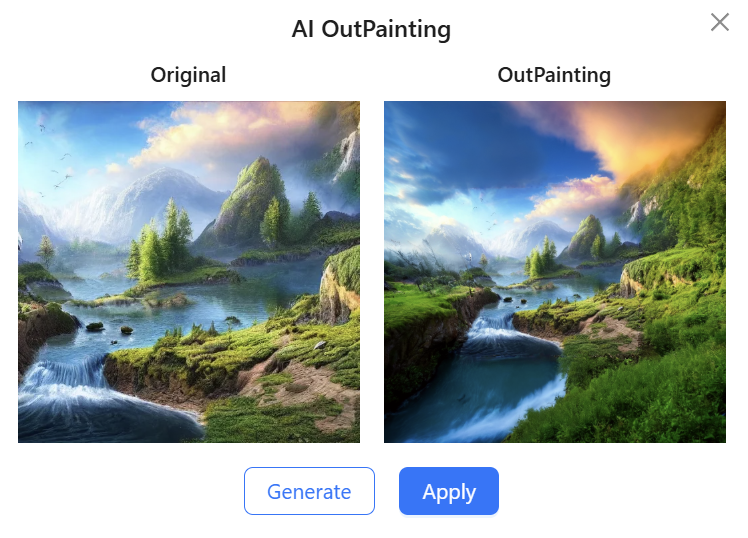

# IntelliPicHub

<div align="center">

🌐 [English](README.md) | **中文** | [日本語](README_ja.md)

</div>

## 简介

IntelliPicHub 是一个多功能的图片展示平台

- **公共空间**：可以用作素材网站，壁纸网站
- **私有空间**：可以作为私人相册，个人作品集
- **团队空间**：可以邀请成员，共享图片，共享素材

**[在线使用](https://picture.jiaheliu.top/)**

## 功能特色

### AI 扩图
除此之外，还可以对图片进行 AI 扩图


### 反向图片搜索
反向图片搜索（搜索相似图片）



### 多人实时协同编辑
在团队空间中可以对图片进行多人实时协同编辑


## 部署指南

### 环境要求

系统中应该安装好以下环境：
- MySQL
- Redis
- Java 17
- Maven

### 1. 克隆项目

```bash
git clone https://github.com/Jiaheliu137/IntelliPicHub
cd IntelliPicHub
```

### 2. 配置后端

#### 2.1 复制配置文件

```bash
cd IntelliPicHub-backend/src/main/resources
cp application.example.yml application-local.yml
```

#### 2.2 填写配置信息

按照提示填写好 `application-local.yml` 中的配置

#### 2.3 配置腾讯云存储

在 [腾讯云存储桶](https://console.cloud.tencent.com/cos/bucket) 中获得以下配置信息：

```yaml
cos:
  client:
    host: your_cos_host
    secretID: your_cos_secret_id
    secretKey: your_cos_secret_key
    region: your_cos_region
    bucket: your_cos_bucket_name
```

并开通 [数据万象服务](https://console.cloud.tencent.com/ci)

### 3. 配置前端

```bash
cd IntelliPicHub-frontend/src/config
```

将 `index.ts` 文件中的 `const PROD_DOMAIN = ''` 改为你自己的域名

### 4. 启动后端

```bash
cd IntelliPicHub-backend
mvn clean package -DskipTests
java -jar target/IntelliPicHub-backend-0.0.1-SNAPSHOT.jar --spring.profiles.active=local
```

### 5. 构建前端

```bash
cd IntelliPicHub-frontend
npm run build-only
```

### 6. Nginx 配置

Nginx 配置参考，将域名和前端打包路径替换为自己的即可：

```nginx
# IntelliPicHub
server {
    listen 80;
    listen 443 ssl http2;
    server_name picture.jiaheliu.top;

    ssl_certificate     /etc/nginx/save_cert_key/wildcard/cert.pem;
    ssl_certificate_key /etc/nginx/save_cert_key/wildcard/key.pem;

    if ($scheme = http) {
        return 301 https://$host$request_uri;
    }

    location / {
        root /root/github_project/IntelliPicHub/IntelliPicHub-frontend/dist;
        index index.html;
        try_files $uri $uri/index.html /index.html;
    }

    location /api {
        proxy_pass http://localhost:8123/api;
        proxy_set_header Host $proxy_host;
        proxy_set_header X-Real-IP $remote_addr;
        proxy_set_header X-Forwarded-For $proxy_add_x_forwarded_for;
        proxy_set_header Connection "";
        proxy_buffering off;
    }
    
    location /api/ws {
        proxy_pass http://localhost:8123/api/ws;
        proxy_http_version 1.1;
        proxy_set_header Upgrade $http_upgrade;
        proxy_set_header Connection "upgrade";
        proxy_set_header Host $proxy_host;
        proxy_set_header X-Real-IP $remote_addr;
        proxy_set_header X-Forwarded-For $proxy_add_x_forwarded_for;
        proxy_read_timeout 86400s;
        proxy_send_timeout 86400s;
        proxy_buffering off;
    }
} 

```

